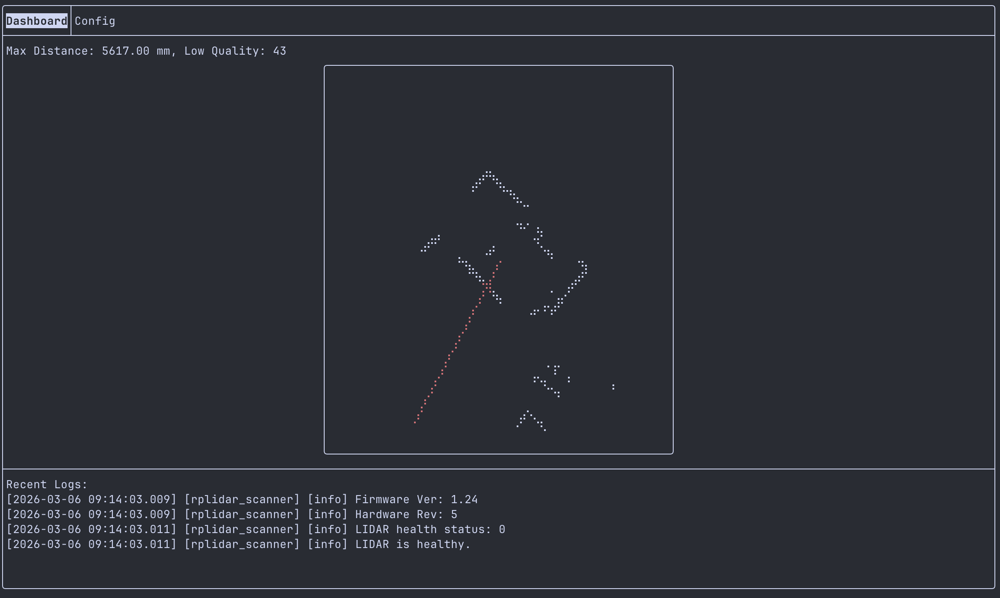

# RPLIDAR SCANNER

This is a rplidar tui visualizer that can also send data via OSC and is supposedly cross-platform.



## Usage

### Build

The build requires an internet connection due to the use of FetchContent and ExternalProject.

```sh
cmake -S . -B build -G Ninja && cmake --build build 
```

## Dependencies

- 
- 
- 
- 
- 
